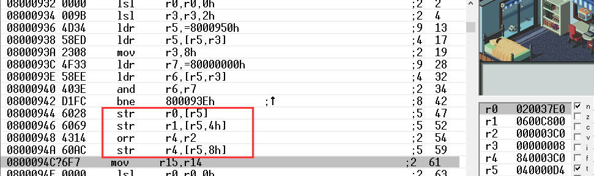
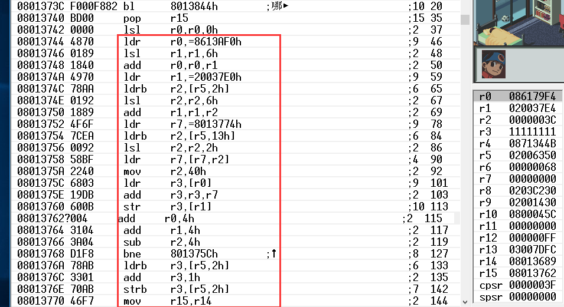
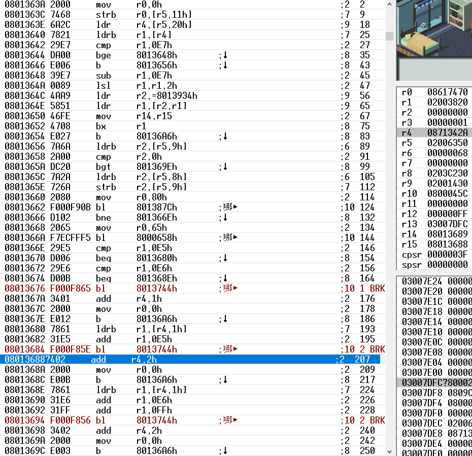
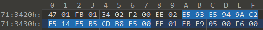
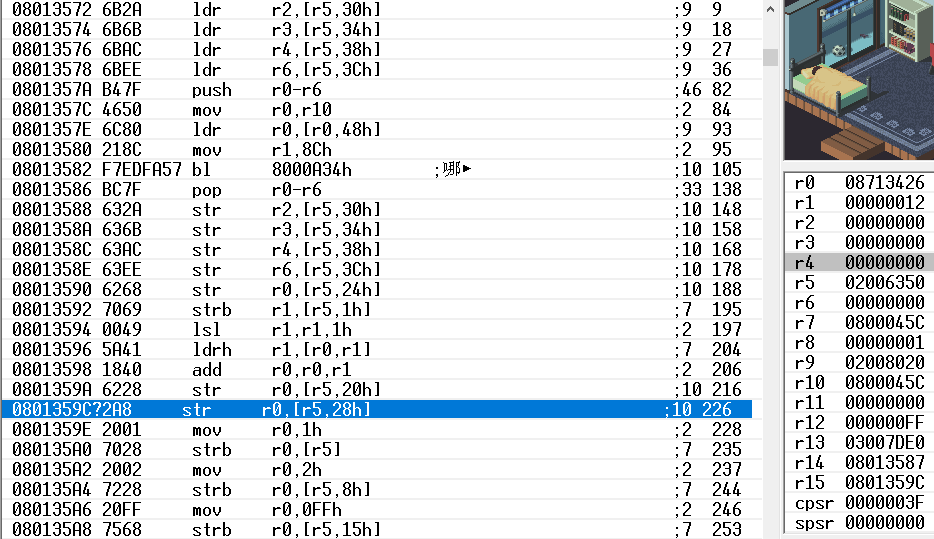
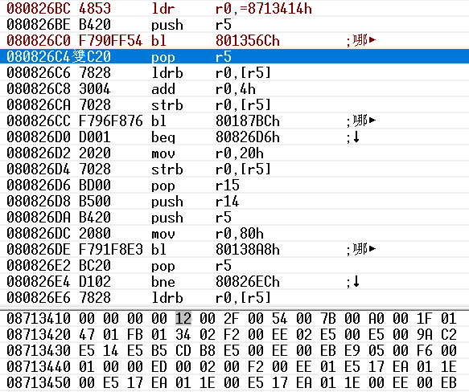

# ROCKMAN EXE 程序分析

  


<div align=center>
    0003 - Battle Network Rockman EXE (J)
</div>


### 一、寻找字库


运行游戏查看VRAM，字模 **热** 上半部分tile所在的内存地址为 **0600C800h**


设置内存写入断点 **[0600C800h..0600C820h]!**

重新运行（Run -> Reset & Run ）直到程序中断



```assembly
;r5 = 040000D4h 查阅资料文档得知这段代码是通过DMA通道3 传输数据

str r0, [r5]		;r0 = 020037E0h 数据源地址
str r1, [r5, 4h]	;r1 = 0600C800h 数据目标地址
orr r4, r2			;r2 = 000003C0h 数据大小地址
					;r4 = 84000000h DMA3 Enable 使能
str r4, [r5, 8h]
```

| 端口地址 | 端口说明  | 可读/写 | 备注                    |
| :------: | :-------: | :-----: | :---------------------- |
| 40000D4h |  DMA3SAD  |    W    | DMA通道3 源地址         |
| 40000D8h |  DMA3DAD  |    W    | DMA通道3 目标地址       |
| 40000DCh | DMA3CNT_L |    W    | DMA通道3 数据大小（字） |
| 40000DEh | DMA3CNT_H |   R/W   | DMA通道3 控制（字）     |

继续跟踪设置内存写入断点 **[020037E0h..020037F0h]!**



```assembly
;这里有几个常量值

ldr r0, 08613AF0h	;用Tile查看器打开游戏文件，跳转到地址 613AF0h 发现是字库起始地址
					;修改此处08xxxxxx，移动字库位置到xxxxxx
					;（对于汉化来说原字库是肯定不够的，这里可以解决字库问题）
...
ldr r1, 020037E0h	;这里我们知道是字模数据在内存中的起始地址，或者说 缓冲区起始地址
...
```

```assembly
;单步调试分析这段子程序，在 08013744h 处设置执行断点

08013744h:			;写字模数据到缓冲区
ldr r0, 08613AF0h	;字库起始地址
lsl r1, r1, 6h		;寄存器 r1 = 9Ah 字模的编码
add r0, r0, r1		;计算字模偏移地址
;分析：
;游戏字库为4bpp，就是指4bit一个像素，一个Tile块8x8也就是64像素，
;64x4bit/8bit=20h字节，游戏字模大小8x16就是40h字节
;r1左移6位，相当于 r1 x 40h，最后加上字库起始地址刚好是字模数据地址
ldr r1, 020037E0h	;字模从游戏卡带写入内存缓冲区
ldrb r2, [r5, 2h]	;r5=02006350h, [r5+2] 缓冲区字模数量
lsl r2, r2, 6h
add r1, r1, r2		;计算字模写入缓冲区的地址
ldr r7, 08013774h	;文字颜色起始地址
ldrb r2, [r5, 13h]	;[r5+13h]=文字颜色 0.普通 1.灰色 2.红色 3、4未知...
lsl r2, r2, 2h		;计算偏移地址
ldr r7, [r7, r2]	;r7=偏移地址
mov r2, 40h			;准备写字模数据到缓冲区 长度40h字节
0801375C:
ldr r3, [r0]
add r3, r3, r7		;改变文字颜色
str r3, [r1]
add r0, 4h
add r1, 4h
sub r2, 4h
bne 0801375Ch
ldrb r3, [r5, 2h]
add r3, 1h			;缓冲区字模数量+1，准备下一个
strb r3, [r5, 2h]
mov r15, r14		;退出子程序
```


### 二、寻找文本数据

子程序退出后程序断在 **08013668h ** 处



寄存器 **r4 = 0871342Ah** ，使用十六进制编辑器查看地址 **71342Ah**，这里是 对话文本数据



三处红字部分就是刚刚分析的 **子程序 08013744** ，寄存器 r1 = 0x9A 是文本字模的编码

```assembly
;往上看汇编代码，在此处设置执行断点，重新运行到程序中断

ldr r4, [r5, 20h]	;r4 = 8713426h 文本数据起始地址，[r5+20h] 文本数据地址指针
ldrb r1, [r4]		;取数据 1byte
cmp r1, E7h			;比较数据，大于或等于E7h为 控制符
bge 8013648h		;if r1 >= E7h jmp 8013648h
b 8013656h			;else jmp 8013656h

8013648h:			;计算控制符程序偏移然后jmp
sub r1, E7h
lsl r1, r1, 2h
ldr r2, 8013934h
ldr r1, [r2, r1]
mov r14, r15
bx r1

8013656h:			;暂时不管
ldrb r2,[r5, 9h]
cmp r2, 0h
bgt 801369Eh
ldrb r2, [r5, 8h]
strb r2, [r5, 9h]
mov r0, 80h
bl 801387Ch
bne 801366E
mov r0, 65h
bl 8000658h

cmp r1, E5h			;if r1 = E5h
beq 8013680h		;jmp 8013680h
cmp r1, E6h			;else if r1 = E6h
beq 801368Eh		;jmp 801368Eh
bl 8013744h			;else 单字节文本码表 范围 00 - E4
add r4, 1h
mov r0, 0h
b 80136A6h

8013680h:			;双字节文本码表 范围 E5 00 - E5 FF
ldrb r1, [r4, 1h]
add r1, E5h
bl 8013744h
add r4, 2h
mov r0, 0h
b 80136A6h

801368Eh:			;双字节文本码表 范围 E6 00 - E6 XX
ldrb r1, [r4, 1h]
add r1, E6h
add r1, FFh
bl 8013744h
add r4, 2h
mov r0, 0h
b 80136A6h
```

内存地址 **[r5 + 20h]** 指向文本数据地址，设置内存写入断点 **[2006350+20h]!** 重新运行到程序中断



```assembly
;寄存器 r0 = 08713426h 第一句话文本数据起始地址
str r0, [r5, 20h]		;写入内存 [r5+20h]
str r0, [r5, 28h]		;写入内存 [r5+28h]
```

继续单步执行直到跳出当前子程序



r0 = 8713414h，十六进制查看此处值为 0012h

8713414h + 0012h = 8713426h，刚好是第一句话文本数据的其实地址，以此类推后面几句话的偏移地址

此处也只是游戏刚开始剧情对话，看数据也只有几句话，游戏后面应该还有很多类似剧情触发对话，但是此处的处理程序是通用的，所以只要在 **801356Ch** 处设置执行断点


#### 未完待续...
